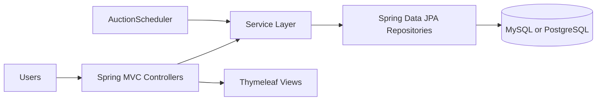

# Auction System

[](https://www.oracle.com/java/)
[](https://spring.io/projects/spring-boot)
[](https://www.thymeleaf.org/)
[](https://www.mysql.com/)
[](https://render.com/)

Role-based auction platform built with Spring Boot, Thymeleaf, and JPA. The app supports Admin, Seller, and Buyer workflows with scheduled auction processing and production deployment options.

## Quick Navigation

- [Feature Overview](#feature-overview)
- [Architecture](#architecture)
- [Tech Stack](#tech-stack)
- [Local Setup](#local-setup)
- [Deployment on Render](#deployment-on-render)
- [Default Accounts](#default-accounts)
- [Routes at a Glance](#routes-at-a-glance)
- [Project Structure](#project-structure)
- [Troubleshooting](#troubleshooting)

## Feature Overview

| Role   | What You Can Do                                                                         |
| ------ | --------------------------------------------------------------------------------------- |
| Admin  | Approve or reject products, manage users, monitor system activity, manage auction slots |
| Seller | Add products, configure price and schedule, track product state and bidding activity    |
| Buyer  | Browse active auctions, inspect details, place bids, view bid history, search products  |

## Architecture



## Tech Stack

| Layer     | Technology                                 |
| --------- | ------------------------------------------ |
| Runtime   | Java 11                                    |
| Framework | Spring Boot 1.1.8.RELEASE                  |
| Web       | Spring MVC + Thymeleaf                     |
| Data      | Spring Data JPA + Hibernate                |
| Databases | MySQL (default), PostgreSQL (prod profile) |
| Security  | Session auth + BCrypt password encoding    |
| Build     | Maven                                      |
| Container | Docker multi-stage build                   |

## Local Setup

### Prerequisites

1. Java 11+
2. Maven 3.6+
3. MySQL 8+ (or PostgreSQL if using profile override)

### Run with MySQL (default)

1. Create database:

```sql
CREATE DATABASE Auction_System;
```

2. Update datasource values in src/main/resources/application.yml as needed.
3. Start the app:

```bash
mvn clean spring-boot:run
```

4. Open:

```text
http://localhost:9090
```

## Deployment on Render

This repository already contains:

- render.yaml
- Dockerfile
- Procfile
- build.sh and start.sh

### Recommended env vars

| Variable               | Purpose                         |
| ---------------------- | ------------------------------- |
| SPRING_PROFILES_ACTIVE | Set to prod                     |
| DATABASE_URL           | Managed DB connection string    |
| DB_USERNAME            | DB username                     |
| DB_PASSWORD            | DB password                     |
| PORT                   | Runtime port injected by Render |

## Default Accounts

| Role   | Username | Password  |
| ------ | -------- | --------- |
| Admin  | admin    | admin123  |
| Seller | seller1  | seller123 |
| Buyer  | buyer1   | buyer123  |

Change these credentials immediately for any shared or public deployment.

## Routes at a Glance

| Area   | Routes                                                                                           |
| ------ | ------------------------------------------------------------------------------------------------ |
| Auth   | GET /login, POST /login, GET /register, POST /register, GET /logout                              |
| Admin  | GET /admin/dashboard, GET /admin/products, GET /admin/users, GET /admin/slots                    |
| Seller | GET /seller/dashboard, GET /seller/products, GET and POST /seller/product/add                    |
| Buyer  | GET /buyer/dashboard, GET /buyer/auctions, GET /buyer/auction/{id}, POST /buyer/auction/{id}/bid |

## Project Structure

```text
Auction-System-main/
   src/main/java/com/in/
      controller/
      service/
      repository/
      entity/
      scheduled/
   src/main/resources/
      templates/
      application.yml
      application-prod.yml
      application-postgres.yml
   Dockerfile
   render.yaml
   pom.xml
```

## Troubleshooting

### Database connection issues

- Ensure database is reachable and credentials are correct.
- Verify selected profile matches DB driver and dialect.

### Old UI still visible

- Rebuild app so templates are recopied to target/classes.
- Restart service and do a hard refresh in browser.

### Port conflict

- Default local port is 9090.
- Override via server.port or PORT.

## Roadmap

- Live bid updates
- Notification pipeline
- Better auction analytics
- Optional REST-first API mode

## Contributing

1. Create a feature branch.
2. Keep commits small and focused.
3. Run build before opening PR.
4. Open a pull request with test notes and screenshots.

## License

This project is created for educational purposes.
